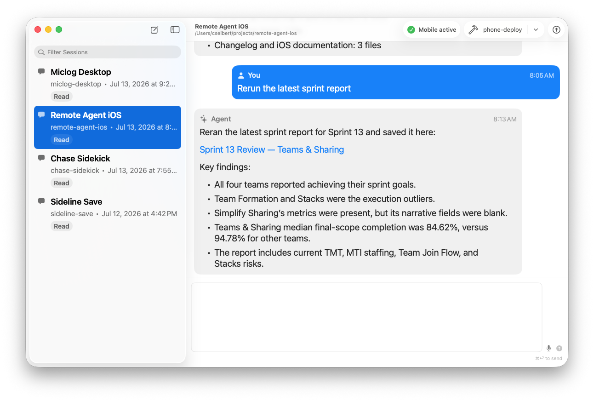
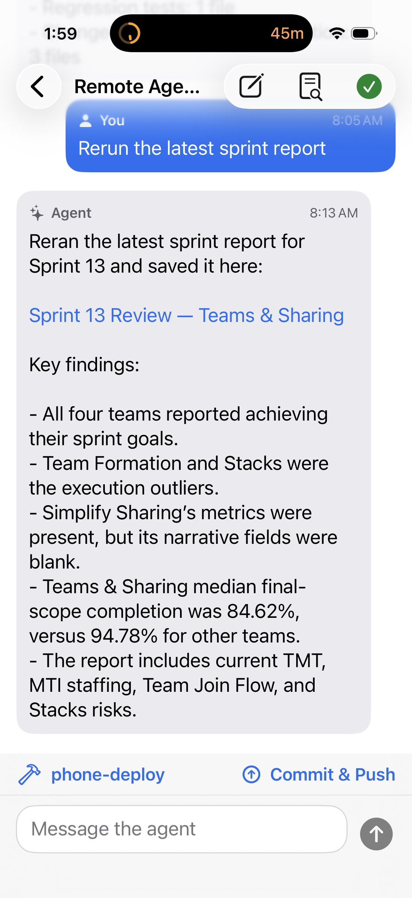

# Remote Agent

**Work seamlessly on your Codex projects whether you are at your desktop or on your phone.**

Remote Agent keeps the same projects and Codex sessions within reach through a native Mac host and companion iPhone/iPad app. Pair Remote Agent with Tailscale on your Mac and phone to reach the host over your private tailnet and keep working from anywhere.

<p align="center">
  
  &nbsp;
  
</p>

Both apps live in this monorepo so host UI, API, protocol, and mobile changes can ship atomically.

## Repository layout

- `Apps/MacHost`: SwiftPM macOS menu/window app and authenticated local-network API.
- `Apps/iOS`: SwiftUI iPhone/iPad client and its Xcode tests.
- `Packages/RemoteAgentProtocol`: shared endpoint definitions and API request contracts.
- `docs/macOS`: Mac host product and implementation documentation.
- `docs/iOS`: mobile product and implementation documentation.

## Common commands

```sh
make setup
make build
make test
make lint
```

App-specific commands are namespaced, including `make mac-build`, `make mac-test`, `make ios-build`, and `make ios-test`. `make mac-bundle` packages the Mac app without launching it; `make mac-run` explicitly rebuilds and restarts it.

See [docs/architecture.md](docs/architecture.md) for the product boundary and [docs/setup-install.md](docs/setup-install.md) for development setup.
