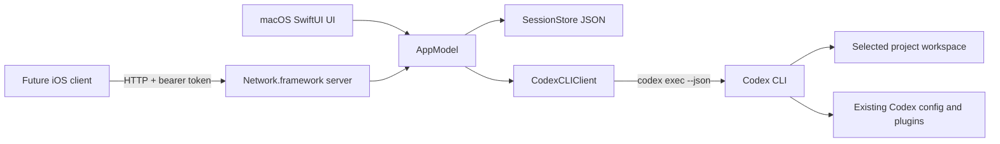

# Architecture

Remote Agent is a dependency-free Swift package that is packaged as a conventional macOS `.app`. SwiftUI owns the application and windows; Foundation, Speech, AVFoundation, Network, and AppKit provide platform integration.

## Components

- `AppModel` is the main-actor source of truth for projects, local sessions, global recent-session selection, active turns, errors, and API routing. The Mac sidebar derives a deterministic view capped at 50 sessions, with pinned sessions first and activity ordering within each group; persistence and API results retain the full collection.
- Session pin state is persisted metadata and does not alter activity timestamps. Deletion removes the local transcript only after confirmation in the Mac UI and rejects active sessions so in-flight Codex results cannot be orphaned. The authenticated API exposes the same behavior through session `PATCH` and `DELETE`, and returns pinned-first session lists.
- Session renames are validated metadata updates persisted through `SessionStore`; they do not change activity timestamps or interrupt active turns.
- `ProjectScanner` invokes `/usr/bin/find` to list immediate child directories of the configured root. Codex currently has no stable, non-interactive machine-readable project-list command.
- `CodexCLIClient` launches the configured Codex executable with `Process`, sends prompts over standard input, parses JSONL events, records the returned thread ID, and resumes it on future turns.
- `SessionStore` atomically persists Remote Agent's session metadata and visible transcripts under Application Support. Codex separately persists its own conversation/tool state.
- `SpeechTranscriber` uses `SFSpeechRecognizer` and `AVAudioEngine`; speech is only an input method and does not change the agent protocol.
- `LocalLinkResolver` recognizes absolute, `file://`, and project-relative filesystem links. Markdown, HTML, and supported source-code files are routed to typed SwiftUI document windows; other local files use Launch Services, and network URLs remain system-handled.
- `RemoteAPIServer` is a small HTTP/1.1 server built on Network.framework. It listens on IPv4/IPv6 with peer-to-peer support, advertises `_remoteagent._tcp` through Bonjour, accepts one request per connection, and delegates state changes to `AppModel`. Parsing caps headers at 32 KB and bodies at 2 MB, rejects invalid framing, and times out incomplete requests after 15 seconds.
- `ProjectDocumentService` discovers read-only Markdown, HTML, and common source-code files inside a selected project for mobile viewing. It skips hidden and common generated directories, does not follow content outside the project root, and limits reads to 2 MB of UTF-8 text.
- `APIActivityStore` keeps the 500 most recent HTTP request summaries under Application Support. It records timestamps, source hosts, client identifiers, routes, response statuses, and durations, but never authorization headers or request bodies.
- `CrashRelaunchController` arms a small bundled watchdog process while the app is running. A marker removed during normal termination prevents relaunch after Quit; an unclean exit leaves the marker armed so the watchdog reopens the same app bundle.

## Turn data flow

1. The app appends and persists the user's message, then marks the session running.
2. A new session runs `codex exec --json --color never --skip-git-repo-check -C <project> -`.
3. A continued session runs `codex exec resume --json --skip-git-repo-check <thread-id> -` with the project as its process working directory.
4. The JSONL parser captures `thread.started` and the final completed `agent_message`.
5. The app persists the Codex thread ID and assistant response, clears running state, and updates clients through their next poll.

## Tradeoffs and boundaries

- CLI execution preserves Codex configuration/plugin behavior and avoids coupling to private APIs, at the cost of one process per turn.
- The visible transcript is duplicated locally so the app and iOS API remain fast and stable even if Codex's private storage format changes.
- Version one returns a `202 Accepted` for phone-submitted prompts and uses polling rather than implementing WebSockets or server-sent events.
- Because HTTP connections are short-lived, “mobile active” means a non-loopback request reached the Mac within the last 30 seconds; it does not imply a continuously connected socket.
- The HTTP server has bearer-token authentication but no TLS. It is intended only for a trusted local network. Bonjour provides discovery but not trust; a later release should add key pairing, TLS, and token rotation UX before enabling broader access.
- There is no approval bridge in version one. The effective Codex sandbox and approval behavior comes from the user's Codex CLI configuration; Remote Agent never passes a dangerous bypass flag.
